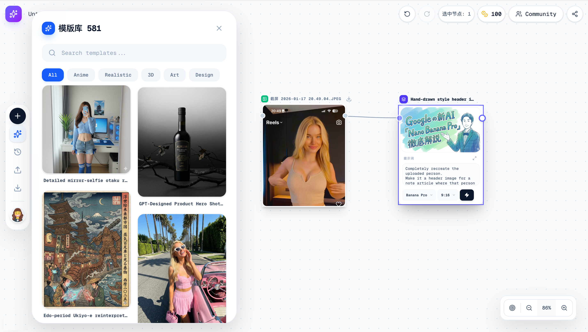

# TemplateFlow - Build AI workflows, not prompts.


<p align="center">
  <picture>
    
  </picture>
</p>

> Build AI workflows in minutes — without fighting prompts, parameters, or scripts.

<p align="center">
  <b>English</b> | <a href="./README.md">简体中文</a>
</p>

<p align="center"> 
 
<a href="https://discord.gg/uxpfAXTB">
    
  </a>
 
</p>


**TemplateFlow** is a visual AI workflow editor for creators and developers who want results fast.

Instead of tuning endless prompts or memorizing parameters, you drag ready-made AI templates onto a canvas, connect them, and run.

From idea → workflow → output, in minutes.

## 🤔 Why TemplateFlow?

Most AI workflow tools are powerful — but overwhelming.

TemplateFlow focuses on clarity, speed, and reuse:

- ❌ No blank canvas anxiety

- ❌ No parameter deep-dives

- ❌ No scripting required

- ✅ Just pick a template, connect the node, and generate.

## 🆚 TemplateFlow vs Other AI Workflow Tools

| Feature | TemplateFlow | ComfyUI / Others |
|------|------|------|
| Zero-setup templates | ✅ Built-in | ❌ Mostly manual |
| Beginner friendly | ✅ Drag & run | ❌ Steep learning curve |
| Template sharing | ✅ JSON-based | ⚠️ Limited |
| Open source | ✅ 100% | ⚠️ Partial |
| Creator-focused | ✅ | ❌ Developer-first |


🎬 See It In Action


> Build your first AI workflow in under 30 seconds.
<!-- 十个以内的核心功能 -->

## ✨ Key Features

- 🚀 Zero-config AI templates — no parameter tuning

- 🧩 Drag-and-drop workflow builder

- 📦 Import & export workflows as lightweight JSON files

- 🔒 Local-first & privacy-friendly deployment

- 🤖 Multi-model support

- ♾️ Infinite canvas with smooth zoom & pan

- ⏪ Undo / redo & keyboard shortcuts

- 💻 Extensible architecture for developers


<!-- 示例gif -->


## 📢 Join the TemplateFlow Community

- Why join our Discord?

- 🚧 Early access to new features

- 🧠 Share & request workflow templates

- 🗳️ Vote on roadmap priorities

- 🛠️ Get help directly from the maintainer

👉 [Join Discord](https://discord.gg/uxpfAXTB)

## 🛠️ Quick Start

**Prerequisites:**

- Node.js 22.0+

- An Fal AI provider API key

1. Clone the repository
   ```bash
   git clone https://github.com/heyaohuo/TemplateFlow.git
   cd TemplateFlow
   ```

2. Install dependencies
   ```bash
   npm install
   ```

3. Create a .env file in the root directory (refer to .env.example if available)


4. Start the dev server
   ```bash
   npm run dev
   ```

5. Open `http://localhost:3000`。


## 🗺️ Roadmap

- Roadmap priorities are driven by community feedback.


## 👋 Maintained & Open

TemplateFlow is actively developed and maintained.

If you find this project useful, consider starring ⭐ the repo — it helps the project grow and stay sustainable.


## 🤝 Contributing

Contributions, issues, and template ideas are welcome!
